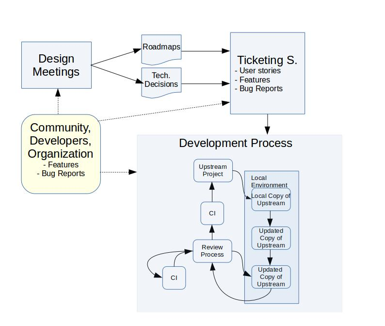

# Introduction

Infrastructure is one of the key aspects when dealing with inner source.
This provides the tools necessary to develop and communicate across
the development teams.

Developers, middle management and C-level are all part of this process.
All of these groups are part of the mindset change to be part of a more open
software development process. And any of those should accept the new rules to play.

As inner source aims at bringing some of the principles when developing
in open source communities, inner source communities needs a cultural
change where open communication and transparency in the decision making
process are vital.

Thus the selected infrastructure must be open and transparent by design.
And this should help developers to follow some specific tracks such as
code review processes. This should help to avoid work arounds as well.
Any contributor to the new infrastructure must follow the same rules.
There will be differences in the access level permited such as
those developers that are newcomers versus those that already have
commit rights.

In addition to this, this infrastructure must be simple following the
KISS (Keep It Short and Simple) approach. This will help to lower the
barrier access to new contributors. The easier the process is,
the more attractive the process to first contribute to any data source.

This is something that already takes place in OSS communities. They
usually need a subscription in some of the tools such as
the mailing lists or the wikis. And once this is done, the contributor
is allowed to update wikis or send emails. In the case of the source code
the process has been lately more bureaocratic as code review has
become more and more important.

On the other hand, sites like [GitHub](https://github.com) or [GitLab](https://gitlab.com)
provide under one single account access to work on the source code, issues, pull requests
and wiki editions. Communities using this infrastructure usually have a
governance model where any type of change should be followed by a review
from a trusted committer.

When inner sourcing, there are key aspects that should be taken into
account. All of those are related to being opened, transparent as their
main attributes, but also archivable, searchable and friendly when used
and mined.

* **Openness**. Every tool used in the software development process should be
  accessible by anyone within the organization. Any person related in somehow
  to the development process should have access to this. This is helpful to
  build confidence across developers and lower the barriers to anyone willing
  to contribute to the inner sourced projects. Any contribution is welcome and
  being open to any type of contributor is necessary.

* **Transparency**. This is focused on the authorship of the several contributions.
  From pure code submission processes to fixing typos, everything needs to
  be registered and the authorship of any change should have an author.

  Having the authorship of any contribution will help to understand who are the
  main contributors within the community. And those will be part of the core of
  such communities. As there are contributions beyond the code, the ownership of
  the contributions should help to understand other types of contributions. From
  documentation to mentorship or helping others in the forums are activities of
  interest in inner source communities.

* **Archivable**. Any tool should provide an archive of previous actions. This will
  help when talking about specific pieces of code, previous technical discussions
  in the communication channels or decisions made during the design summits. This
  should help for referencing purposes.

* **Searchable**. As more and more projects will be added to the inner source process,
  the amount of repositories of information will grow in the same way. It is
  important to have searching capabilities within the platform. This will help
  to reuse and discover projects and contributors useful for our own purposes.
  This should also help to understand if there are other projects filling
  your specific needs.

* **Data Retrieval Friendly**. This is an important aspect. The toolchain selected should
  be easy to mine. This could be an external tool that mines any
  available data source and builds specific areas of the software development
  process. Or this could be provided by the very same infrastructure.
  This will help the community to understand where the bottlenecks in the process
  are found, but also will help to detect potential flames, blockers and
  any other non-desired situation.

  As detailed in the metrics chapter, data play a key
  role in the deployment of the inner source methodology. This will help
  to understand where the whole process is going and make decisions when
  necessary to follow the right direction. For this, tools that allow
  to retrieve information through an API (e.g.: GitHub API) or thanks to
  a log system (e.g.: 'git log' command line) are of great importance.

* **Access rights**. As there is an open and transparent process to make decisions
  that foster the participation, it is worth using an infrastructure that
  limits the access to certain roles within the organization. Everyone is
  invited to participate, but a subset of the contributors will have the right
  to submit those pieces of source code or edit the wikis in the documentation.
  The infrastructure should allow this roles division. Anyone is welcome to read,
  but some of them are allowed to write.

All of these are probably already known as those are key aspects when deploying
infrastructure in open source projects. There are two great books that have already
dealt with this issue. [_Producing Open Source Software_ by _Karl Fogel_](http://producingoss.com/)
and [_The Art of Community_ by _Jono Bacon_](http://www.artofcommunityonline.org/).
The first one focuses on the needed and
basic infrastructure when starting from scratch an open source project. While
the latter is focused on how to support specific workflows with tools. And
both are great approaches when dealing with open source projects and partially
useful when dealing with inner source projects.

As Jono states in his book "_To select the right tools for the job, we need
first to understand what we are trying to achieve. We need to know what our
**workflow** is_".

The following section focuses on the infrastructure needs when starting an
inner source project. In the basics there are not main differences from the
key aspects point of view. However we have to deal with existing, internal
and in some cases access-restricted infrastructure and check if that infrastructure is enough
for our new purposes and goals when inner-sourcing.

Thus there are two main areas to consider: first if we can reuse existing
infrastructure and second if we need new infrastructure, what tools
are available that fit with our key-aspects requirements.

# Basic Infrastructure

As inner source is mainly about cultural change, we need to have an easy-access
and low barrier tools. The easier to use, the more developers that will try
in first place to work with other business units and inner-sourced projects.

Although there is a code review process and this takes time to learn, there are
other areas where developers can start to contribute. From documentation and
mere typos in the collaborative wiki to design meetings and even review
activities in projects of your interest or asking for feature requests. There
is a myriad of potential actions that anyone within the organization can help
with. And the goal of inner source is to foster those actions as much as possible
letting developers know that those actions are really much appreciated.

The infrastructure is thus divided into three main areas:

* In first place the development process infrastructure that contains
the basic tooling for developers.
Selecting the right tools will help to have a clear process and that process
will bring trustiness to the community. Any developer must follow that process
and work arounds should not exist. As an example, any developer, even core
or trusted committers should face a review process when submitting a piece
of code. It is clear that trusted committers have a reputation in the community
and this will help in the review process, but they still need to go through
the process.
A clear workflow brings trust across the business units. That certainty in the
definition of requirements, software development process, use of versioning or
ticketing systems, the code review process and the continuous integration helps
with this.

* In second place a solid use of the communication channels infrastructure.
These tools should be as transparent as possible and any technical meeting must
be followed by a summary of results and decisions in the mailing list. This helps
to open technical discussions, but also to reference to previous decisions
made.
As we are considering large organizations, it is also necessary the use of
asynchronous communication channels such as the usual IRC in open source
communities. More advanced options could be the use of [Slack](https://slack.com) but also
[Mattermost](https://mattermost.com) if the organization prefers to use
open source and in house SaaS deployments.

* In third place the monitoring infrastructure is key when applying inner source and
in general when bringing a new methodology to organizations. This is one of the
main differences with open source communities. They are open by default and basically
follow the detailed key aspects. However, infrastructure to measure process advances
have not been one of the main goals in the case of open source communities.
Basically they are using a successful development methodology, each of them
with their own peculiarities, but open by default.
Inner source needs of this type of infrastructure as managers and developers
need feedback about their performance. A change in the software development
process of large organizations, a cultural change and the community building
process needs a large set of actions and those actions should have the
confirmation that they are working. For this the organization and its
business units need of a monitoring infrastructure.

## Development process infrastructure

When developing there are three main tools to take into account: the versioning
, code review and continouos integration systems. Those should follow a process
similar to the one depicted in the following picture. If this process
is familiar to you is because this is based on the [OpenStack software development
process](https://docs.openstack.org/infra/manual/developers.html) as detailed in their wiki site.
I have copied the workflow as this contains the basic pieces also needed for
inner source. Other communities use a similar approach, although I did not find
a nice picture! Sorry folks!. In addition to this, this is a new figure as
I wanted to have it independent of the infrastructure. OpenStack uses
Git, Gerrit and other tooling for this process, but others are also possible.
As an example the Linux Kernel uses mailing lists for the code review process
or the Mozilla community that uses another toolchain. Think of the figure
as a generic way to introduce code review and continuous integration aspects
in the software development process.

In short, the process in the figure is as follows: the developer should clone the repository(1)
make changes to it (2), run some local tests (3), pull request those changes (4),
tests will be run (5) with a specific result (6). If that result is negative,
then we need to go through a new version of the code and come back to the
local environment (7: Review process -> Updated Copy of Upstream). If the
CI works and there is a positive answer from the Review Process, then this go
again through CI before being committed to master (8). If the review process
provides a negative evaluation then the piece of code goes back again
to the submitter (7: Review process -> Updated Copy of Upstream).

* ** Versioning system **: this tool is used by developers to store the
several iterations of a given piece of software. As developers are basically
geographically distributed, the versioning system should allow this type of
interactions, where any developer at any time may submit a piece of code
to be reviewed. Systems that allow off-line development are highly
recommended as developers will be able to locally work and later submit the code.

* ** Code review system **: once the piece of code is ready to be submitted,
this should be previously reviewed by another developer. This forces developers
to submit that piece of code through a specific process. As an example,
there are several ways where open source communities code review others, using
specific tools, sending the piece of code to a mailing list or integrated
in the versioning system tool. As one of the main goals when inner sourcing
is to keep the process as simple as possible, the main recommendation is to
avoid too noise channels (as mailing lists) or too hard to use tools.
It is also recommended to use tools that help others to start developing a new
piece of source code without needing to submit that to review. Early discussions
in the code review process helps to produce better code and having mentors
involved in the process.

* ** Continuous integration (CI) system **: this is one of the key tooling when
developing. There are already several eyes having a look at the source code
in the code review process. With the addition of a continuous integration
platform, any type of test should be covered: regression, unit testing, end
user tests, etc. Ideally this platform should be integrated with the code
review process. In this way, developers can wait for the answer for the CI
system before proceeding with the code review process. They would be sure
that this works prior any effort from them.

* ** Ticketing system **: tickets are useful to attract community to an
inner source project. This helps in two specific ways: transparency of the
development process, raising issues and having a roadmap of the issues
to be closed. And in second place, to provide a platform for newcomers and
users to detail their needs. Tickets are helpful to bring community in inner
source projects as users of the platform will open bug reports, but also
feature requests. And even those can socialized as the community can vote
those reports and declare what are the most important for them. This information
is key to let developers know about the community and business units needs.
Then all of this can be discussed during the design summits defining further
roadmaps based on users, developers and organizations requirements.

* ** Documentation system **: documentation is now available to any member
of the organization. And documentation has extra goals when producing it. Not
only to developers, but to users. Indeed the documentation should be focused
on several roles. From developers to users, the documentation should cover
their needs. And as such, documentation should be transparent and open to
any potential change from members. This will help to adequate the documentation
to the users needs, but also to other members within the organization.
The tool used should allow to have all of these pieces of information. From the
usual developers APIs to high level users interested in understanding what
that piece of code offers to the organization. It is worth mentioning that
the documentation also covers information as general as the mission and
the type of things that the piece of code does and the things that this does
not do.

* ** Collaborative design platform **: inner source in large organizations
is a synonym of geographically distributed teams. Face to face meetings are
hard to have in this type of organizations, but there should exist infrastructure
to bridge those difficulties. Requirements specifications, technical decisions,
TODOs lists and others should be stored in this type of collaborative environments.
This will provide transparency to the process, but also informal documentation
and communication. Even when the developers are in face to face meetings,
those tools should be used as they will leave traces of activity readable
by others within the organization.

## Communication channels infrastructure

Inner source is about cultural change. And that cultural change is based on
transparency and meritocracy. Communication channels should be open within
the organization, and anyone is allowed to post to them.

Any decision out of the public channels should be later written down in these
as any decision should be traceable and referenceable.

* ** Mailing Lists / Forums **: this asynchronous way of communicating across the
developer teams is highly effective. Being geographically distributed force
the members of the organization to avoid direct communication channels
when possible as people lives in different time zones.

* ** Instant Messaging **: this is another asynchronous communication channel.
From the usual IRC channels used in open source software, to other open
source options such as Mattermost, this helps to lead technical discussions,
store the log information and have all of the developers in a virtual room
where they can discuss, but also users can enter looking for advice.

* ** Questions / Answers **: this type of platforms help to raise questions and
share those with the rest of the community. Users and developers can vote
the most interesting ones and this helps to bring attention to issues of interest
for the internal inner-sourced community.

* ** Video conference **: face to face meeting definitively helps. And even more
when discussing about technical issues. This type of synchronous communication
channels are useful for discussions but force people to be at the same time
in the same virtual room. As there could be members from several time zones,
those are more difficult to set than conversations in the instant messaging
or mailing lists.

## Monitoring infrastructure

This infrastructure is needed to understand the current situation of the
software development process and should help in the decision making process.
One of the key aspects when choosing a specific toolchain is that this is
_data retrieval friendly_. This means that any tool is now a data source
and such data source should provide a way to mine this. This will provide
raw data information that should be later parsed and treated to be useful.

There is extra information in the metrics chapter, but in brief, any organization
applying inner source, or any other new methodology, should have a way to
check how that new process is performing when compared to the old way.

This monitoring infrastructure should also have as outcomes several ways of
accessing such information. And this depends on the role accessing the information.
Although everyone in the organization may have access to the information
released by the development and communication channels toolchain, not all of them
will be interested in accessing the raw data or the high level and quarterly reports
focused on C-level.

For this the monitoring platform should provide access to the raw data retrieved
from all of the data sources, to the enriched data after removing inconsistencies,
and the final outcomes as dashboards, KPIs or quarterly reports. Indeed, having
actionable data will help the members of the community to align those outcomes
to their specific needs.

The following is a potential architecture that could help when accessing
the several data layers, from raw information to detailed visualizations.

* **Retrieval Platform**: this first part uses as input any of the data
sources already mentioned. Version systems, mailing lists, tickets,
collaborative documents and others should have some way of retrieving
the information those contain. There may be some tools that produce events
and those events are not stored anymore. This platform should take care of
these cases. As an example of temporary logs, if there is not a policy to take
care of the Apache logs or the jobs run by a Jenkins instance, there is not a
way to retrieve old datasets.

* **Enrichment Platform**: this part of the data analysis focuses on cleaning
and preparing the data for visualization.

* **Visualization Platform**: this third part of the monitoring platform should
help to produce the outcomes needed to track the status of the methodology
process. By visualization, this platform produces actionable charts, but
also KPIs or static documents to be shared with third parties.

# Comparing how inner-sourced your infrastructure is

Just detailing the infrastructure needed within an organization to effectively
apply inner source would be simplistic. This section aims at listing the
questions you need to ask to your infrastructure team to check if
that internal and well known infrastructure is able to be part of the
inner source process.

The goal of this section is to compare the internal infrastructure used within
an organization and check how close this is to an ideal inner source toolchain.
As detail, in the software development process, it is necessary the use of
specific tools such as the versioning system, code review process, ticketing
system, continuous integration, documentation storage and collaborative
platform to share technical decisions.

For each of those, we need to check if they are following the key aspects
provided such as openness.

**Development process infrastructure**

 |                     | Openness | Transparency | Archivable | Searchable | Monitoring | Access Rights |
 |---------------------|----------|--------------|------------|------------|------------|---------------|
 | Versioning          |          |              |            |            |            |               |
 | Ticketing system    |          |              |            |            |            |               |
 | Code Review         |          |              |            |            |            |               |
 | CI                  |          |              |            |            |            |               |
 | Wiki/Documentation  |          |              |            |            |            |               |
 | TODO List           |          |              |            |            |            |               |
 | Collaborative notes |          |              |            |            |            |               ||

**Communication Channels Infrastructure**

 |                     | Openness | Transparency | Archivable | Searchable | Monitoring | Access Rights |
 |---------------------|----------|--------------|------------|------------|------------|---------------|
 | Mailing lists/forums|          |              |            |            |            |               |
 | Instant channels    |          |              |            |            |            |               |
 | Questions/Answers   |          |              |            |            |            |               ||

**Monitoring Infrastructure**

 |                         | Openness | Transparency | Archivable | Searchable | Monitoring | Access Rights |
 |-------------------------|----------|--------------|------------|------------|------------|---------------|
 | Retrieval platform      |          |              |            |            |            |               |
 | Enrichment platform     |          |              |            |            |            |               |
 | Visualization platform  |          |              |            |            |            |               ||

# Some examples of Infrastructure

GitHub enterprise.
GitLab.
In house repositories.
Attlasian stack.
