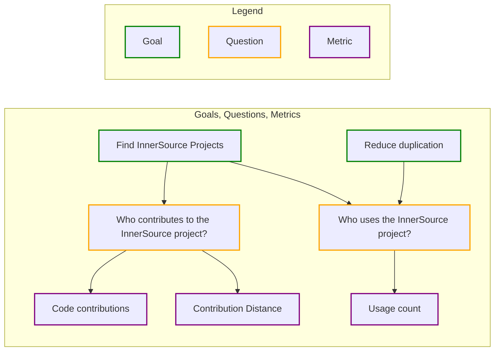

```mermaid
graph LR;

    subgraph GQM[Goals, Questions, Metrics]

    %% begin nodes
    find-projects.md[Find InnerSource Projects]
    reduce-duplication.md[Reduce duplication]
    who-contributes.md[Who contributes to the InnerSource project?]
    who-uses.md[Who uses the InnerSource project?]
    code-contributions.md[Code contributions]
    contribution-distance.md[Contribution Distance]
    usage-count.md[Usage count]
    %% end nodes

    %% begin edges
    find-projects.md-->who-uses.md
    find-projects.md-->who-contributes.md
    reduce-duplication.md-->who-uses.md
    who-contributes.md-->code-contributions.md
    who-contributes.md-->contribution-distance.md
    who-uses.md-->usage-count.md
    %% end edges

    %% begin clicks
    click find-projects.md "https://github.com/InnerSourceCommons/managing-inner-source-projects/blob/main/measuring/goals/find-projects.md" "Find InnerSource Projects"
    click reduce-duplication.md "https://github.com/InnerSourceCommons/managing-inner-source-projects/blob/main/measuring/goals/reduce-duplication.md" "Reduce duplication"
    click who-contributes.md "https://github.com/InnerSourceCommons/managing-inner-source-projects/blob/main/measuring/questions/who-contributes.md" "Who contributes to the InnerSource project?"
    click who-uses.md "https://github.com/InnerSourceCommons/managing-inner-source-projects/blob/main/measuring/questions/who-uses.md" "Who uses the InnerSource project?"
    click code-contributions.md "https://github.com/InnerSourceCommons/managing-inner-source-projects/blob/main/measuring/metrics/code-contributions.md" "Code contributions"
    click contribution-distance.md "https://github.com/InnerSourceCommons/managing-inner-source-projects/blob/main/measuring/metrics/contribution-distance.md" "Contribution Distance"
    click usage-count.md "https://github.com/InnerSourceCommons/managing-inner-source-projects/blob/main/measuring/metrics/usage-count.md" "Usage count"
    %% end clicks

  end
      subgraph Legend
        direction TB

        goal[Goal]
        question[Question]
        metric[Metric]

        classDef goals stroke:green,stroke-width:2px;
        class goal,find-projects.md,reduce-duplication.md goals

        classDef questions stroke:orange,stroke-width:2px;
        class question,who-contributes.md,who-uses.md questions

        classDef metrics stroke:purple,stroke-width:2px;
        class metric,code-contributions.md,contribution-distance.md,usage-count.md metrics
      end  
  
```
