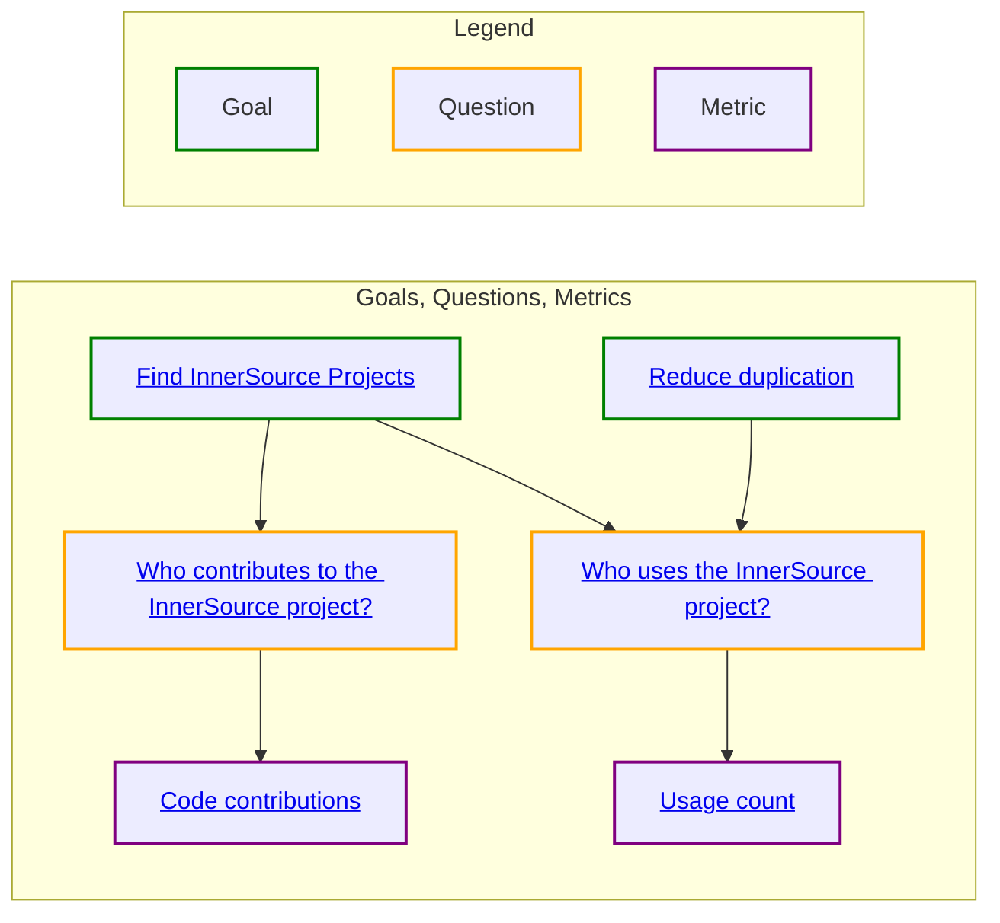

# Use Goals, Questions, and Metrics

*An overview of the Goals, Questions, and Metrics (GQM) catalog.*

This page works better in GitHub; [click here](https://bit.ly/3tOrsbO).

<!--- 

WARNING: Changes to this graph are overwritten by a GitHub workflow. 

To update this graph, add new goals, questions, and metrics to the following directores.

./goals
./questions
./metrics

A GitHub workflow will automatically update this graph with your changes.

See this README.md file for more information about how to add goals, questions, and metrics.

./gqm_gen/README.md

To test your changes see this README.md file.

../scripts/gqm_gen/README.md

--->

Add your goals, questions, and metrics into this graph!  It will help you to see how others approach and interact with what you are doing.
You may get new ideas of what metrics answer the questions you have or what additional goals your questions can support.
See [CONTRIBUTING.md#metrics].

[CONTRIBUTING.md#metrics]: https://github.com/InnerSourceCommons/managing-inner-source-projects/blob/main/CONTRIBUTING.md#metrics
