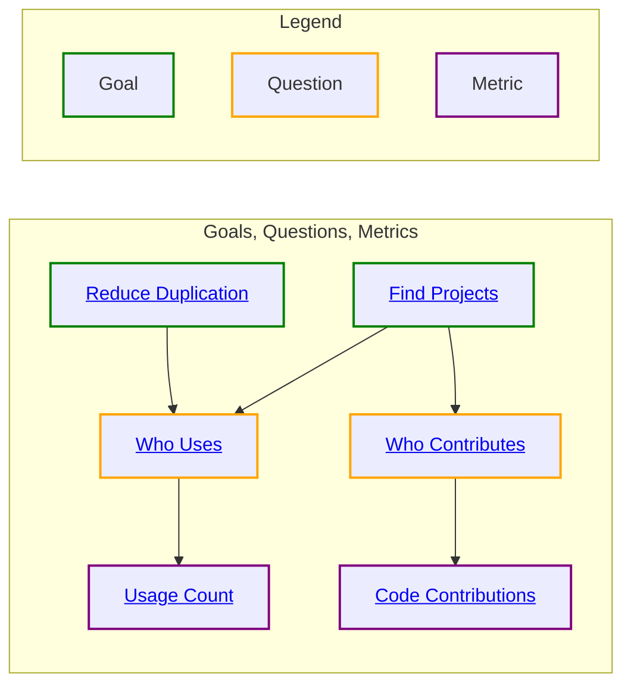

# Use Goals, Questions, and Metrics

*An overview of the GQM catalog.*

```mermaid
graph LR;
    subgraph GQM[Goals, Questions, Metrics]
        find-projects[<a href='https://github.com/InnerSourceCommons/managing-inner-source-projects/blob/master/measuring/goals/find-projects.md' target='_blank'>Find Projects</a>] --> who-uses[Who Uses]
        reduce-duplication[<a href='https://github.com/InnerSourceCommons/managing-inner-source-projects/blob/master/measuring/goals/reduce-duplication.md'>Reduce Duplication</a>] --> who-uses[<a href='https://github.com/InnerSourceCommons/managing-inner-source-projects/blob/master/measuring/questions/who-uses.md'>Who Uses</a>]
        who-uses --> usage-count[<a href='https://github.com/InnerSourceCommons/managing-inner-source-projects/blob/master/measuring/metrics/usage-count.md'>Usage Count</a>]
        find-projects --> who-contributes
        who-contributes[<a href='https://github.com/InnerSourceCommons/managing-inner-source-projects/blob/master/measuring/questions/who-contributes.md'>Who Contributes</a>] --> code-contributions[<a href='https://github.com/InnerSourceCommons/managing-inner-source-projects/blob/master/measuring/metrics/code-contributions.md'>Code Contributions</a>]
    end
    subgraph Legend
        direction TB

        goal[Goal]
        question[Question]
        metric[Metric]

        classDef goals stroke:green,stroke-width:2px;
        class goal,find-projects,reduce-duplication goals

        classDef questions stroke:orange,stroke-width:2px;
        class question,who-uses,who-contributes questions

        classDef metrics stroke:purple,stroke-width:2px;
        class metric,code-contributions,usage-count metrics
    end
```
