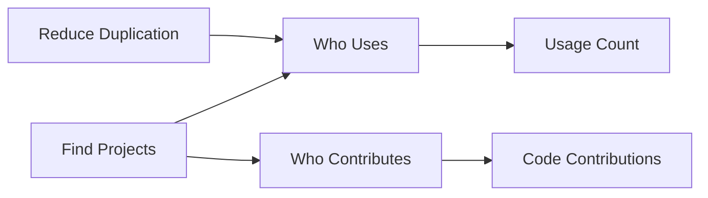

# Use Goals, Questions, and Metrics

*An overview of the GQM catalog.*

## Goals

* [Reduce Duplication](../goals/reduce_duplication.md)  

## Questions

* [Who uses the InnerSource project?](../questions/who-uses.md)

## Metrics

* [Usage Count](../metrics/usage_count.md)
