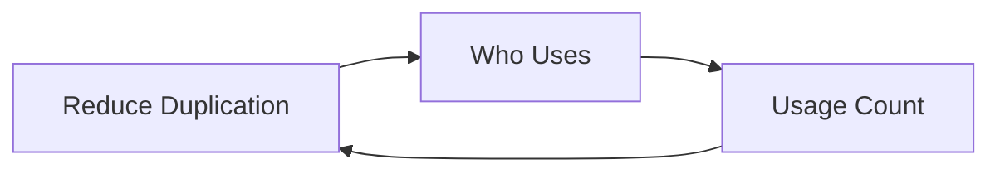

# Use Goals, Questions, and Metrics

```mermaid
graph LR;
reduce-duplication[Reduce Duplication] --> who-uses[Who Uses];
click reduce-duplication href "https://jeffs-organization-3.gitbook.io/managing-inner-source-projects/measuring/questions/who-uses" "We can see how many times an InnerSource project is reused.  If there is extra information attached to that usage (like which business unit is the user) then we can see how widely across the company an InnerSource project is used." _blank;

who-uses --> usage-count[Usage Count];
usage-count --> reduce-duplication[Reduce Duplication];
```
