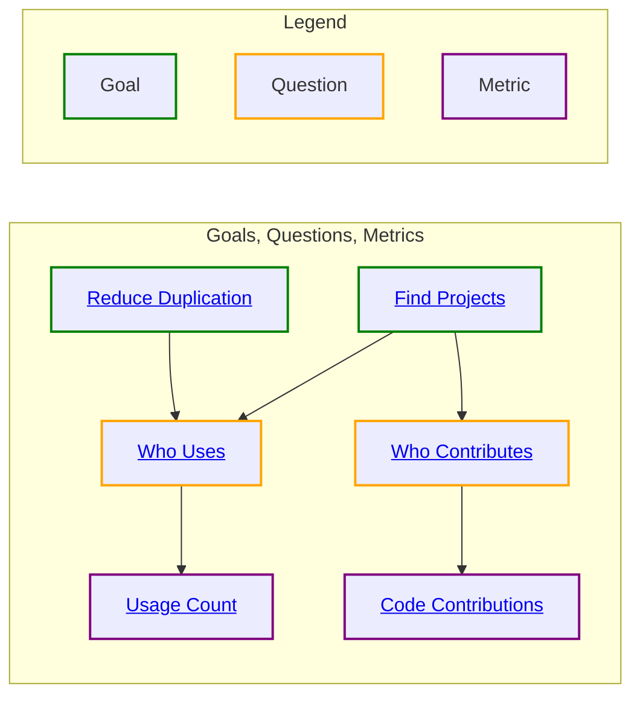

# Use Goals, Questions, and Metrics

*An overview of the Goals, Questions, and Metrics (GQM) catalog.*

This page works better in GitHub; [click here](https://bit.ly/3tOrsbO).

Add your goals, questions, and metrics into this graph!  It will help you to see how others approach and interact with what you are doing.
You may get new ideas of what metrics answer the questions you have or what additional goals your questions can support.
See [CONTRIBUTING.md#metrics].

[CONTRIBUTING.md#metrics]: https://github.com/InnerSourceCommons/managing-inner-source-projects/blob/main/CONTRIBUTING.md#metrics
