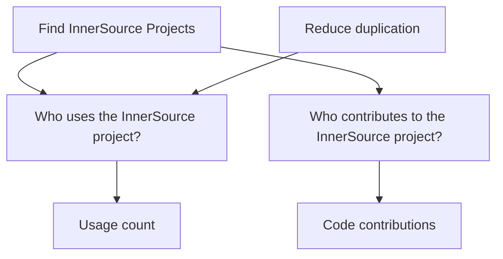

> gqmgen@1.0.0 start

```mermaid
graph TB
find-projects.md[Find InnerSource Projects]
reduce-duplication.md[Reduce duplication]
who-contributes.md[Who contributes to the InnerSource project?]
who-uses.md[Who uses the InnerSource project?]
code-contributions.md[Code contributions]
usage-count.md[Usage count]
find-projects.md-->who-uses.md
find-projects.md-->who-contributes.md
reduce-duplication.md-->who-uses.md
who-contributes.md-->code-contributions.md
who-uses.md-->usage-count.md

```
