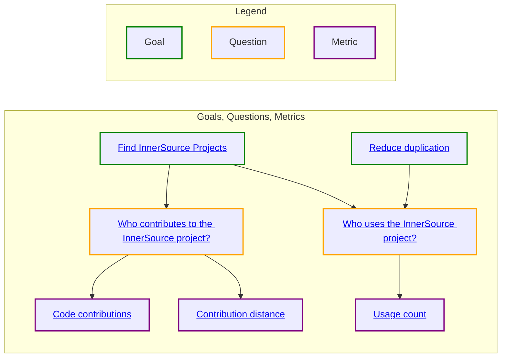

```mermaid
graph LR;

    subgraph GQM[Goals, Questions, Metrics]

      find-projects.md[<a href='https://github.com/InnerSourceCommons/managing-inner-source-projects/blob/main/measuring//goals/find-projects.md'>Find InnerSource Projects</a>]
    reduce-duplication.md[<a href='https://github.com/InnerSourceCommons/managing-inner-source-projects/blob/main/measuring//goals/reduce-duplication.md'>Reduce duplication</a>]
    who-contributes.md[<a href='https://github.com/InnerSourceCommons/managing-inner-source-projects/blob/main/measuring//questions/who-contributes.md'>Who contributes to the InnerSource project?</a>]
    who-uses.md[<a href='https://github.com/InnerSourceCommons/managing-inner-source-projects/blob/main/measuring//questions/who-uses.md'>Who uses the InnerSource project?</a>]
    code-contributions.md[<a href='https://github.com/InnerSourceCommons/managing-inner-source-projects/blob/main/measuring//metrics/code-contributions.md'>Code contributions</a>]
    contribution-distance.md[<a href='https://github.com/InnerSourceCommons/managing-inner-source-projects/blob/main/measuring//metrics/contribution-distance.md'>Contribution distance</a>]
    usage-count.md[<a href='https://github.com/InnerSourceCommons/managing-inner-source-projects/blob/main/measuring//metrics/usage-count.md'>Usage count</a>]
    find-projects.md-->who-uses.md
    find-projects.md-->who-contributes.md
    reduce-duplication.md-->who-uses.md
    who-contributes.md-->code-contributions.md
    who-contributes.md-->contribution-distance.md
    who-uses.md-->usage-count.md
  end
      subgraph Legend
        direction TB

        goal[Goal]
        question[Question]
        metric[Metric]

        classDef goals stroke:green,stroke-width:2px;
        class goal,find-projects.md,reduce-duplication.md goals

        classDef questions stroke:orange,stroke-width:2px;
        class question,who-contributes.md,who-uses.md questions

        classDef metrics stroke:purple,stroke-width:2px;
        class metric,code-contributions.md,contribution-distance.md,usage-count.md metrics
      end  
  
```
