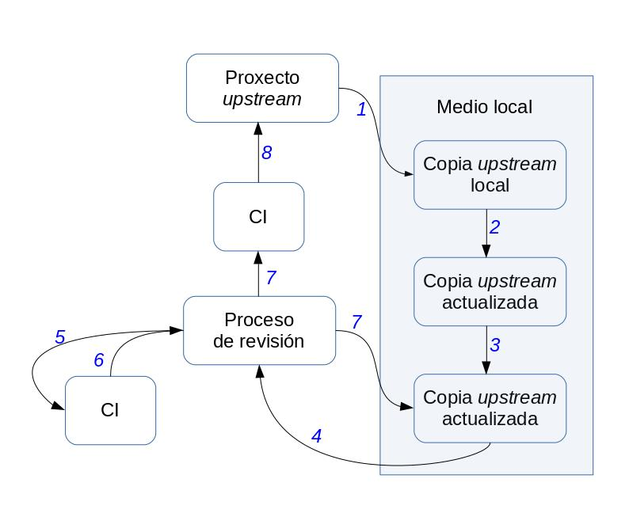

# Infraestrutura básica

Posto que InnerSource consiste principalmente nun cambio cultural, necesitamos ferramentas de fácil acceso ou baixa barreira de entrada. Canto máis sinxelas sexan de empregar, maior será o número de desenvolvedores/as interesados/as en traballar noutras áreas da empresa e proxectos InnerSource.

Aínda que existe un proceso de revisión de código e leva tempo aprender a facelo, tamén hai outras áreas nas que os/as desenvolvedores/as poden contribuír. Na documentación, na mera corrección de erratas da wiki colaborativa, e ata nas reunións de deseño; ou, incluso, en actividades de revisión, en proxectos do interese do/da colaborador/a ou mediante a petición de novas funcionalidades. Posto que hai diferentes xeitos de colaborar na empresa, o obxectivo de InnerSource é fomentar este tipo de accións o máximo posible, para facerlle saber saber ao equipo de desenvolvemento que as súas accións son valoradas.

Así pois, a infraestrutura estará dividida en tres áreas principais:

- En primeiro lugar, na infraestrutura do proceso de desenvolvemento que contén as ferramentas básicas para os/as desenvolvedores/as: seleccionar as ferramentas axeitadas servirá para contar cun proceso claro que achegue confianza á comunidade. Calquera desenvolvedor/a debe seguir ese proceso co fin de evitar problemas imprevistos. Por exemplo, calquera desenvolvedor/a, incluso os/as *trusted committers*, deben afrontar un proceso de revisión cando envían un fragmento de código. Certo é que os *trusted committers* xa contan cunha reputación na comunidade que lles será de utilidade pero, aínda así, terán que pasar tamén por este proceso de revisión. Un fluxo de traballo ben definido achega confianza a todas as áreas empresariais. Por iso mesmo, a certeza na definición de requisitos, no proceso de desenvolvemento do software, no uso de sistemas de versionado ou de tíckets, no proceso de revisión do código e na integración continua resultará de grande axuda.
- En segundo lugar, un uso rigoroso da infraestrutura das canles de comunicación: estas ferramentas deben ser o máis transparentes que sexa posible e todas as reunións técnicas deben ir seguidas dun resumo que inclúa os resultados e decisións na listaxe de correo. Isto axuda na apertura de discusións técnicas, pero tamén á hora de referenciar as decisións que foron tomadas con anterioridade. Como este libro toma como exemplo grandes empresas, tamén é necesario o uso de canles de comunicación asíncronas como o IRC, moi habitual nas comunidades de software libre. Algunhas opcións máis avanzadas poderían ser [Slack](https://slack.com/intl/es-es/), ou mesmo [Mattermost](https://mattermost.com/), no caso de que a empresa prefira empregar software libre interno SaaS (polas súas siglas en inglés, software como servizo).  
- En terceiro lugar, a infraestrutura da monitoración é chave á hora de aplicar InnerSource e, en xeral, de achegar unha nova metodoloxía ás empresas. Esta é unha das principais diferenzas entre as comunidades de software libre; abertas por defecto e ligadas aos aspectos chave mencionados. Con todo, a infraestrutura empregada para medir os avances nos procesos non é un dos obxectivos primordiais das comunidades de software libre que, en xeral, empregan unha metodoloxía de desenvolvemento exitosa, cada comunidade coas súas propias particularidades, pero aberta por defecto. InnerSource necesita este tipo de infraestrutura, posto que tanto o equipo de desenvolvemento como os/as superiores/as de área precisan da retroalimentación para mellorar o seu rendemento. Calquera cambio no proceso de desenvolvemento de software nas grandes organizacións ou na cultura da empresa coa construción dunha comunidade deben levarse a cabo a través dun conxunto de accións e, á súa vez, será necesaria a confirmación de que esas accións están a funcionar. Para isto, a organización e máis as distintas áreas de negocio precisan dunha infraestrutura de monitoración.

## Infraestrutura do proceso de desenvolvemento

Existen tres aspectos fundamentais para ter en conta na fase de desenvolvemento: o versionado, a revisión do código e os sistemas de integración continua. Estes deben seguir un proceso similar ao que se representa na seguinte imaxe. Se este proceso resulta familiar é porque se basea no [proceso de desenvolvemento de software libre](https://docs.openstack.org/infra/manual/developers.html), tal e como se indica na súa wiki. O seu fluxo de traballo contén as pezas básicas necesarias tamén para InnerSource. Outras comunidades empregan un enfoque similar, mais, lamentablemente, non se dispón doutra figura coa que ilustralo. En calquera caso, esta figura é nova, pois preferíaa independente da infraestrutura. OpenStack usa Git, Gerrit e distintas ferramentas para este proceso, aínda que tamén outras serían posibles. Por exemplo, Linux Kernel emprega listaxes de correo para o proceso de revisión do código e a comunidade Mozilla emprega outras ferramentas. Considere a seguinte figura como unha forma xenérica de introducir información sobre distintos aspectos da revisión do código e a integración continua no proceso de desenvolvemento de software.

En resumo, o proceso que segue a figura é o seguinte: o/a desenvolvedor/a debe clonar o repositorio (1), facer cambios nel (2), executar algunhas probas locais (3), presentar as *pull requests* para eses cambios (4), despois realizaranse algunhas probas (5) cun resultado específico (6). Se ese resultado é negativo, necesitamos pasar por unha nova versión do código e volver ao medio local (7: proceso de revisión → Copia actualizada *upstream*). Se a CI funciona e o proceso de revisión ten unha resposta positiva, pasa de novo por CI antes de que se integre no código mestre (8). Se o proceso de revisión proporciona unha avaliación negativa, o fragmento de código volve de novo ao/á provedor/a (7: proceso de revisión → Copia actualizada *upstream*).

- **Sistema de versionado**: emprégano os/as desenvolvedores/as para almacenar as distintas interaccións dun determinado software. Nos casos en que están distribuídos en distintas localizacións xeográficas, o sistema de versionado permite que calquera, en calquera momento, poida enviar un fragmento de código para a súa revisión. Os sistemas que facilitan o desenvolvemento *offline* son moi recomendables xa que os/as desenvolvedores/as poderán traballar de xeito local e enviar posteriormente o código.
- **Sistema de revisión do código**: unha vez que un fragmento de código estea listo para ser enviado, debe revisalo previamente outro/a desenvolvedor/a. Isto obriga a contar cun proceso específico para o envío dese fragmento de código. A modo de exemplo, hai varias formas nas que as comunidades de software libre revisan o código enviado; mediante o uso de ferramentas específicas, enviando o fragmento de código a unha listaxe de correo ou a través do sistema de versionado. Como un dos principais obxectivos InnerSource é manter o proceso o máis sinxelo posible, a principal recomendación é evitar canles con moito ruído (como as listaxes de correo) ou ferramentas demasiado difíciles de empregar. Tamén se recomenda utilizar ferramentas que inviten a outros/as a comezar a desenvolver un novo código fonte sen necesidade de envialo para revisar. As primeiras discusións no proceso de revisión do código axudan a producir un código mellor e a contar con mentores/as implicados/as no proceso.
- **Sistema de integración continua (CI)**: esta é unha das ferramentas fundamentais no proceso de desenvolvemento. Xa son varios os ollos postos no código fonte no proceso de revisión; e coa adición dunha plataforma de integración continua, debería cubrirse calquera tipo de proba: regresión, probas unitarias, probas de usuarios/as finais etc. Idealmente, esta plataforma debería integrarse co proceso de revisión do código. Deste xeito, os/as desenvolvedores/as poden agardar pola resposta do sistema CI antes de continuar co proceso de revisión e ter a certeza de que funciona antes de calquera esforzo pola súa parte.
- **Sistema de tíckets**: os tíckets son útiles para atraer comunidade a un proxecto InnerSource. Ademais, teñen dous propósitos específicos: a transparencia no proceso de desenvolvemento, a apertura de incidencias e poder contar cunha folla de ruta das que están por pechar. Por outra banda, proporciona unha plataforma para que usuarios/as e novos/as contribuidores/as indiquen as súas necesidades. Os tíckets permiten achegar á comunidade os proxectos InnerSource, xa que na plataforma non só se abrirán informes de erros, tamén se solicitarán novas funcionalidades. Ao mesmo tempo, favorecen a socialización, xa que a comunidade pode votar e determinar que informes consideran máis importantes. Unha información fundamental para os/as desenvolvedores/as, que poden coñecer as necesidades da comunidade e das distintas áreas de negocio. Para rematar, todo pode discutirse nos cumios de deseño nos que se definen outras follas de ruta baseadas nos requisitos dos/das usuarios/as, desenvolvedores/as e das organizacións.
- **Sistema de documentación**: a documentación agora está dispoñible para calquera membro da organización. E na súa elaboración xurdirán novos obxectivos que non se centran só nos desenvolvedores/as, senón tamén nos/nas usuarios/as. De feito, esta documentación debería centrarse en varios roles, para cubrir as necesidades de todos/as. Ademais, a documentación debe ser transparente e, como tal, aberta a calquera posible cambio por parte dos membros. Isto axudará a adecuala ás necesidades dos/das usuarios/as, pero tamén ás dos demais membros da organización A ferramenta que se empregue debería facer uso de toda esta información; desde as API habituais dos/das desenvolvedores/as ata o interese por comprender o que ese fragmento de código ofrece á organización dos/das usuarios/as de alto nivel. Cómpre indicar que a documentación tamén abrangue información tan xeral como a propia misión ou o tipo de cousas que ese fragmento de código pode facer ou non.
- **Plataforma de deseño colaborativo**: nas grandes organizacións, InnerSource é sinónimo de equipos distribuídos por distintas localizacións xeográficas. As reunións cara a cara son pouco frecuentes, mais deberíase contar con infraestruturas para superar esa barreira. Neste tipo de medios colaborativos, deberíanse almacenar as especificacións de requisitos, decisións técnicas, listaxes de tarefas pendentes e outros datos. Isto proporcionará transparencia ao proceso, pero tamén documentación e comunicación informal. Estas ferramentas deberían empregarse mesmo cando os/as desenvolvedores/as traballan en reunións cara a cara, pois deixarán rastros de actividade, lexibles por outros membros da organización.

## Infraestrutura de canles de comunicación

InnerSource implica un cambio cultural baseado na transparencia e na meritocracia. As canles de comunicación deben estar abertas dentro da organización e calquera pode publicar nelas.

Toda decisión tomada fóra das canles públicas debe ser posteriormente rexistrada nestas, xa que todas as decisións deben poderse rastrexar e referenciar.

- **Listaxes de correo/foros**: a comunicación asíncrona entre os equipos de desenvolvemento é moi eficaz. A distribución xeográfica obriga os membros da organización a evitar as canles de comunicación directa cando sexa posible se os/as colaboradores/as viven en diferentes fusos horarios.

- **Mensaxería instantánea**: é outra canle de comunicación asíncrona, como as canles IRC empregadas habitualmente no software libre ou como Mattermost. Permite liderar discusións técnicas, almacenar a información e xuntar a todos os desenvolvedores/as nunha sala virtual na que poden debater, pero tamén na que os/as usuarios/as poden entrar a buscar consello.
- **Preguntas/respostas**: este tipo de plataformas axuda a compartir preguntas co resto da comunidade. Usuarios/as e desenvolvedores/as poden votar polas máis interesantes, o que axudará a chamar a atención sobre cuestións de interese para a comunidade InnerSource.
- **Videoconferencia**: unha reunión cara a cara é sempre vantaxosa e aínda máis cando se fala de cuestións técnicas. Este tipo de comunicación sincrónica é de grande utilidade para as discusións, mais obriga os membros do equipo a xuntarse ao mesmo tempo e na mesma sala virtual. Como pode ser que se atopen en varias zonas horarias diferentes, estas reunións serán máis difíciles de organizar que as conversas na mensaxería instantánea ou nas listaxes de correo.

## Infraestrutura de monitoración

Esta infraestrutura é necesaria para comprender a situación actual do proceso de desenvolvemento do software e debería servir de axuda na toma de decisións. Un dos aspectos chave ao escoller ferramentas específicas é que faciliten a recuperación de datos. Isto significa que agora que calquera ferramenta é unha fonte de datos, a dita fonte de datos debería proporcionar unha forma de extraelos. Esa información de datos sen procesar deberá analizarse e tratarse despois para que sexa útil.

Amplíase esta información no capítulo de métricas pero, en resumo, calquera organización que aplique InnerSource, ou calquera outra nova metodoloxía, debe ter unha forma de verificar como se está a desempeñar ese novo proceso en comparación co anterior.

Esta infraestrutura de monitoración tamén debería ter como resultado varios xeitos de acceder á dita información. Isto dependerá do rol que acceda á devandita información, pois na organización todo o mundo pode ter acceso á información extraída das ferramentas de desenvolvemento e das canles de comunicación mais, se cadra, non todos/as terán interese en acceder aos datos sen procesar ou aos informes de alto nivel e trianuais enfocados aos altos cargos.

Para isto, a plataforma de monitoración debe proporcionar acceso aos datos sen procesar recuperados de todas as fontes de datos, aos datos enriquecidos despois de eliminar as inconsistencias e aos resultados finais como taboleiros, KPI ou informes trianuais. De feito, ter datos procesables axudará os membros da comunidade a aliñar eses resultados coas súas necesidades específicas.

A seguinte é unha arquitectura potencial que podería axudar no acceso a varias capas de datos, desde información sen procesar ata visualizacións detalladas.

- **Plataforma de recuperación:** emprega como entrada calquera das fontes de datos xa mencionadas: os sistemas de versionado, as listaxes de correo, os tíckets, os documentos colaborativos, entre outros que deben ter algún xeito de recuperar a información que conteñen. Algunhas ferramentas poden xerar eventos que xa non se almacenan. Esta plataforma debería encargarse deses casos. Como exemplo dos *logs* temporais, se non existe unha política para manter os *logs* de Apache ou os traballos executados por unha instancia de Jenkins, non hai xeito de recuperar conxuntos de datos antigos.
- **Plataforma de enriquecemento:** esta parte da análise de datos enfócase en limpar e preparar a información para a súa visualización.
- **Plataforma de visualización:** pode axudar a xerar resultados precisos para rastrexar o status do proceso da metodoloxía. Mediante a visualización, esta plataforma produce gráficos procesables, pero tamén KPI ou documentos estáticos para compartir fóra da empresa.
